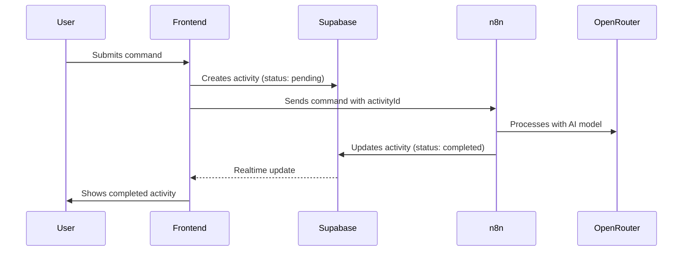

# Activity Flow Documentation

## Overview

This document describes the main flow of activities in the Personal AI Agents Dashboard, specifically focusing on the interaction between the frontend, Supabase, and n8n.

## Components

### 1. Frontend (React + TypeScript)
- Handles user interactions
- Manages activity state through `ActivityContext`
- Listens to realtime updates from Supabase

### 2. Supabase
- Stores activities in the `activities` table
- Provides realtime updates through PostgreSQL changes
- Maintains the source of truth for activity states

### 3. n8n
- Processes AI agent commands
- Updates activity status and content in Supabase
- Integrates with OpenRouter for AI model access

## Main Flow

### 1. Activity Creation


### 2. Detailed Steps

#### a. Frontend Initialization
```typescript
// ActivityContext.tsx
const channel = supabase
  .channel(`activities-channel-${sessionId}`)
  .on(
    'postgres_changes',
    {
      event: 'UPDATE',
      schema: 'public',
      table: 'activities',
      filter: `user_id=eq.${user.id}`
    },
    (payload) => {
      // Handle realtime updates
    }
  )
```

#### b. Activity Creation
```typescript
// Creating new activity
const activity = {
  type: 'message',
  agent: selectedAgent,
  content: command,
  status: 'pending'
};

// Save to Supabase
const { data, error } = await supabase
  .from('activities')
  .insert(activity)
  .select()
  .single();
```

#### c. n8n Processing
```javascript
// n8n workflow
{
  "nodes": [
    {
      "type": "@n8n/n8n-nodes-langchain.agent",
      // Process command with AI
    },
    {
      "type": "n8n-nodes-base.supabase",
      "parameters": {
        "operation": "update",
        "tableId": "activities",
        "fieldsUi": {
          "fieldValues": [
            {
              "fieldId": "detailed_content",
              "fieldValue": "={{ $json.output }}"
            },
            {
              "fieldId": "status",
              "fieldValue": "completed"
            }
          ]
        }
      }
    }
  ]
}
```

## State Management

### Activity States
- **pending**: Initial state when activity is created
- **completed**: Final state after n8n processing
- **error**: When processing fails

### Frontend State Updates
The frontend relies solely on Supabase realtime updates to reflect activity state changes:

```typescript
// ActivityContext.tsx
const handleUpdate = (payload) => {
  const updatedActivity = convertSupabaseActivity(payload.new);
  setActivities(prev => prev.map(activity => 
    activity.id === updatedActivity.id ? updatedActivity : activity
  ));
};
```

## Best Practices

1. **Single Source of Truth**
   - Supabase is the source of truth for activity states
   - Frontend only updates through realtime subscription
   - n8n is the only service updating activity status

2. **State Flow**
   - Activities always start as "pending"
   - Only n8n can set status to "completed"
   - Frontend reflects Supabase state immediately

3. **Error Handling**
   - Failed n8n processing sets status to "error"
   - Network issues show appropriate error messages
   - Duplicate events are handled gracefully

## Common Issues and Solutions

### 1. Duplicate Updates
**Problem**: Multiple updates to the same activity
**Solution**: Remove frontend updates after n8n response

### 2. Race Conditions
**Problem**: Out-of-order updates
**Solution**: Trust Supabase as single source of truth

### 3. State Synchronization
**Problem**: UI not reflecting latest state
**Solution**: Use realtime subscription for immediate updates

## Monitoring and Debugging

### Console Logs
Key events are logged for debugging:
```javascript
// Activity creation
console.log("📝 Creating activity in Supabase:", activity);

// n8n processing
console.log("🔄 Sending command to n8n...");

// Realtime updates
console.log("🔄 UPDATE event received:", {
  id: payload.new.id,
  oldStatus: payload.old?.status,
  newStatus: payload.new.status
});
```

### Key Log Messages
- `📝 Creating activity`: New activity creation
- `✅ Activity saved`: Successful Supabase save
- `🔄 UPDATE event received`: Realtime update from Supabase
- `✨ Applying update`: Frontend state update

## Configuration

### Environment Variables
```env
VITE_SUPABASE_URL=your_supabase_url
VITE_SUPABASE_ANON_KEY=your_supabase_key
VITE_N8N_WEBHOOK_URL=your_n8n_webhook
```

### Supabase Table Schema
```sql
create table activities (
  id uuid default uuid_generate_v4() primary key,
  user_id uuid references auth.users,
  type text,
  agent text,
  content text,
  detailed_content text,
  status text default 'pending',
  created_at timestamptz default now(),
  updated_at timestamptz default now()
);
```

## Testing

### Manual Testing Steps
1. Submit a new command
2. Verify "pending" status
3. Wait for n8n processing
4. Verify "completed" status and response
5. Check console logs for expected flow

### Expected Behavior
1. Activity appears immediately with "pending" status
2. Single update event from n8n
3. Status changes directly to "completed"
4. No intermediate status changes 